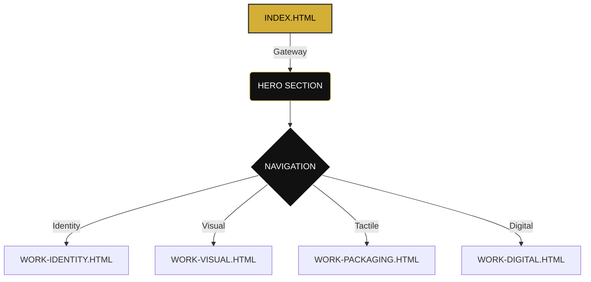

# 
```
  _____  _  _____ _   _  _    ____  _   _ 
 |  __ \| ||  ___| | | || |  |  _ \| | | |
 | |__) | ||___ \| |_| || |  | |_) | |_| |
 |  _  /| | ___) |  _  || |__|  _ <|  _  |
 |_| \_\|_||____/|_| |_||____|_| \_\_| |_|
                                          
 [ ARCHITECTURAL PORTFOLIO SYSTEM v1.0 ]
 [ CODE NAME: NOIR_GOLD_PROTOCOL       ]
```

> **STATUS:** ONLINE  
> **CLEARANCE:** PUBLIC  
> **OPERATOR:** RISHABH CHAUDHARY

---

## 01 // MISSION BRIEF

**Objective:** design and deploy a high-performance, immersive digital portfolio that transcends traditional web design.  
**Target:** To merge cinematic atmosphere with architectural precision.  
**Aesthetic:** *Noir & Gold*. A study in contrast, shadow, and luxury.

This is not just a website. It is a digital gallery. A vault of creative works. An experience.

---

## 02 // VISUAL INTELLIGENCE

> "Design is Intelligence made visible."

The interface operates on a **Cinematic Blueprint** philosophy:
*   **Atmospherics:** Custom grain, spotlight effects, and liquid glassmorphism.
*   **Typography:** *Cormorant Garamond* (The Voice) paired with *Inter* (The Data).
*   **Motion:** Fluid transitions, parallax scrolls, and magnetic cursor physics.

---

## 03 // TECH ARSENAL

The system is built on a foundation of pure, unadulterated web technologies. No frameworks. No bloat. Just raw power.

| COMPONENT | SPECIFICATION | ROLE |
| :--- | :--- | :--- |
| **CORE** | `HTML5` | Structural Integrity |
| **STYLING** | `CSS3` (Advanced) | Visual Physics & Grid Systems |
| **LOGIC** | `Vanilla JavaScript` | Interaction & Animation Engine |
| **FONTS** | `Google Fonts API` | Typographic Assets |
| **ICONS** | `FontAwesome` | UI Symbology |

---

## 04 // DEPLOYMENT SEQUENCE

To initialize this system on your local machine:

```bash
# 1. Clone the repository
git clone https://github.com/Rishabh55122/My-portfolio.git

# 2. Navigate to the sector
cd My-portfolio

# 3. Launch the system
# Open index.html in your preferred browser
# OR use a live server extension
```

---

## 05 // SYSTEM ARCHITECTURE



---

> **[ END OF TRANSMISSION ]**  
> *© 2026 Rishabh Chaudhary. All Systems Nominal.*
